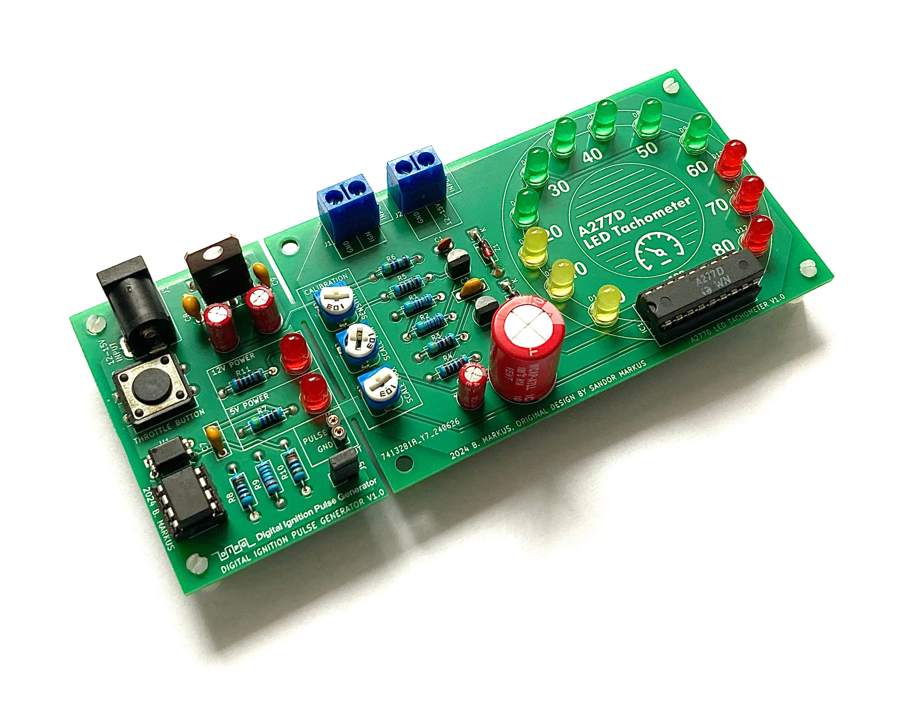
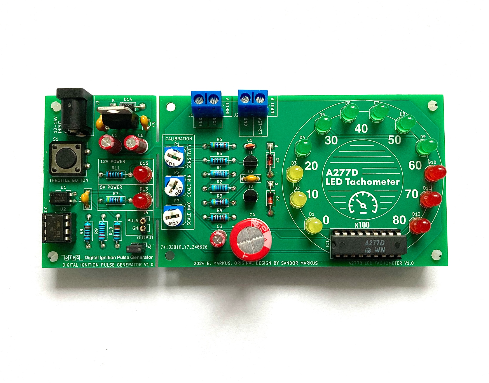
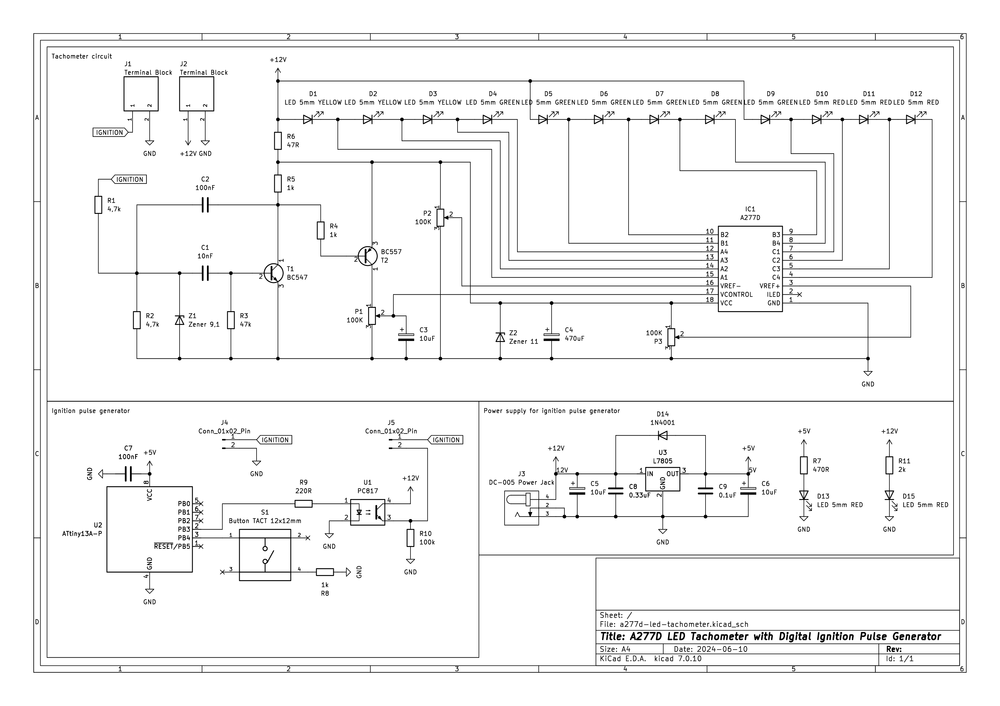

# a277d-led-tachometer

An analog LED tachometer controlled by an East German A277D chip (clone of UAA180), featuring an integrated ATtiny13A-based digital ignition pulse generator for testing.



## Table of Contents

- [Overview](#overview)
- [Features](#features)
- [History](#history)
- [Hardware Description](#hardware-description)
  - [Tachometer Circuit](#tachometer-circuit)
  - [Pulse Generator Circuit](#pulse-generator-circuit)
- [Components (BOM)](#components-bom)
- [How It Works](#how-it-works)
  - [Tachometer Operation](#tachometer-operation)
  - [Pulse Generator Operation](#pulse-generator-operation)
- [Getting Started](#getting-started)
  - [Prerequisites](#prerequisites)
  - [Hardware Assembly](#hardware-assembly)
  - [Programming the ATtiny13A](#programming-the-attiny13a)
  - [Calibration](#calibration)
- [Usage](#usage)
- [Troubleshooting](#troubleshooting)
- [Technical Specifications](#technical-specifications)
- [Acknowledgments](#acknowledgments)

## Overview

This project combines two circuit boards:

1. **Main Tachometer Board**: An analog LED tachometer using the A277D (UAA180 clone) chip that displays engine RPM using a 12-LED bar graph (3 yellow, 6 green, 3 red LEDs)
2. **Digital Pulse Generator Board**: An ATtiny13A-based circuit that generates variable frequency ignition pulses for testing purposes

The pulse generator board is attached to the left side of the main board and can be broken off if the tachometer is to be installed in an actual vehicle.



## Features

- **Analog LED bar graph display** with 12 LEDs (yellow-green-red color scheme)
- **A277D/UAA180 driver chip** for precise LED control
- **Three-point calibration** (sensitivity, scale minimum, scale maximum)
- **Integrated pulse generator** for testing without a vehicle
- **Variable frequency output** (60-200 Hz) with pushbutton control
- **Optocoupled signal isolation** between generator and tachometer
- **12V automotive power supply** with onboard 5V regulation
- **Dual power indicators** (5V and 12V status LEDs)
- **Modular design** - pulse generator can be detached

## History

This circuit has a special history spanning nearly four decades:

In the late 1980s, my father designed this tachometer for his LADA 2105, which lacked a factory-installed tachometer. In 2024, I discovered his original hand-drawn sketches and PCB design prototypes, which inspired me to rebuild this circuit using modern CAD tools while staying true to the original design philosophy.

The base circuit was inspired by a design published on page 213 of the 1987 edition of *Rádiótechnika évkönyve* (Yearbook of Radiotechnics). *Rádiótechnika* was Hungary's longest-running electronics and radio amateur magazine (mid-20th century - 2021), serving as a central resource for hobbyists, engineers, and radio amateurs.

The LED color sequence (yellow-green-red) follows the original design, even though green-yellow-red might be more conventional today.

**Note**: A relevant excerpt from the original 1987 publication is included in `docs/radiotechnika.yearbook.hu1987-203-225.pdf`.

## Hardware Description



### Tachometer Circuit

The main tachometer circuit processes ignition pulses and drives a 12-LED bar graph display.

**Key Components:**
- **IC1 (A277D)**: LED driver chip (East German clone of UAA180)
- **T1 (BC547), T2 (BC557)**: Signal conditioning transistors
- **Z1 (9.1V), Z2 (11V)**: Zener diodes for voltage regulation and protection
- **P1, P2, P3**: 100kΩ trimmer potentiometers for calibration
- **D1-D12**: LED bar graph (3 yellow, 6 green, 3 red)
- **J1, J2**: Terminal blocks for ignition input and 12V power

**Power Requirements:**
- Input: 12-15V DC (automotive)

### Pulse Generator Circuit

The pulse generator uses an ATtiny13A microcontroller to simulate engine ignition pulses.

**Key Components:**
- **U2 (ATtiny13A-P)**: Microcontroller running at 9.6 MHz
- **U1 (PC817)**: Optocoupler for signal isolation and level shifting
- **U3 (L7805)**: 5V voltage regulator for the pulse generator
- **S1**: 12×12mm tactile button (throttle simulation)
- **D13, D15**: Status LEDs (5V and 12V power indicators)
- **J3**: DC-005 power jack
- **J4**: 2-pin female header (pulse output measurement point)
- **J5**: 2-pin male header (connection to tachometer - removable jumper)

**ATtiny13A Pinout:**
```
         ATtiny13A (DIP-8)
         ┌─────┬─┬─────┐
 RESET ──┤1 PB5   VCC 8├── +5V
    NC ──┤2 PB3   PB2 7├── NC (SCK)
BUTTON ──┤3 PB4   PB1 6├── NC (MISO)
   GND ──┤4 GND   PB0 5├── NC (MOSI)
         └─────────────┘
```

**USBasp Programmer Pinout:**
```
    USBasp 10-pin IDC
    ┌─────────────┐
  ──┤1 MOSI  VCC 2├── +5V
  ──┤3 NC    GND 4├── GND
  ──┤5 RESET GND 6├── GND
  ──┤7 SCK   GND 8├── GND
  ──┤9 MISO  GND10├── GND
    └─────────────┘
```

**Programming Connection:**
| USBasp Pin | ATtiny13A Pin | Function |
|------------|---------------|----------|
| VCC (2)    | 8 (VCC)       | +5V      |
| GND (4/6/8/10) | 4 (GND)   | Ground   |
| RESET (5)  | 1 (RESET)     | Reset    |
| SCK (7)    | 7 (PB2)       | Clock    |
| MISO (9)   | 6 (PB1)       | MISO     |
| MOSI (1)   | 5 (PB0)       | MOSI     |

## Components (BOM)

| Item | Qty | Reference(s) | Value | Footprint | Notes |
|------|-----|--------------|-------|-----------|-------|
| 1 | 1 | C1 | 10nF | C_Disc_D3.0mm | Ceramic capacitor |
| 2 | 2 | C2, C7 | 100nF | C_Disc_D7.0mm | Ceramic capacitor |
| 3 | 3 | C3, C5, C6 | 10µF | CP_Radial_D5.0mm | Electrolytic |
| 4 | 1 | C4 | 470µF | CP_Radial_D13.0mm | Electrolytic |
| 5 | 1 | C8 | 0.33µF | C_Disc_D3.0mm | Ceramic capacitor |
| 6 | 1 | C9 | 0.1µF | C_Disc_D3.0mm | Ceramic capacitor |
| 7 | 3 | D1, D2, D3 | LED 5mm YELLOW | LED_D5.0mm | Yellow LEDs |
| 8 | 6 | D4-D9 | LED 5mm GREEN | LED_D5.0mm | Green LEDs |
| 9 | 5 | D10-D13, D15 | LED 5mm RED | LED_D5.0mm | Red LEDs |
| 10 | 1 | D14 | 1N4001 | DO-41 | Rectifier diode |
| 11 | 1 | IC1 | A277D | DIP-18 | LED driver (UAA180 clone) |
| 12 | 2 | J1, J2 | Terminal Block | KF301-2P | 5mm pitch |
| 13 | 1 | J3 | DC-005 | Power Jack | 2.1mm barrel jack |
| 14 | 1 | J4 | Conn_01x02 | PinSocket 2.54mm | Female header |
| 15 | 1 | J5 | Conn_01x02 | PinHeader 2.54mm | Male header |
| 16 | 3 | P1, P2, P3 | 100kΩ | Trimpot RM-065 | Calibration trimmers |
| 17 | 2 | R1, R2 | 4.7kΩ | Axial DIN0207 | 1/4W resistor |
| 18 | 1 | R3 | 47kΩ | Axial DIN0207 | 1/4W resistor |
| 19 | 3 | R4, R5, R8 | 1kΩ | Axial DIN0207 | 1/4W resistor |
| 20 | 1 | R6 | 47Ω | Axial DIN0207 | 1/4W resistor |
| 21 | 1 | R7 | 470Ω | Axial DIN0207 | 1/4W resistor |
| 22 | 1 | R9 | 220Ω | Axial DIN0207 | 1/4W resistor |
| 23 | 1 | R10 | 100kΩ | Axial DIN0207 | 1/4W resistor |
| 24 | 1 | R11 | 2kΩ | Axial DIN0207 | 1/4W resistor |
| 25 | 1 | S1 | Button TACT | 12×12mm | Momentary pushbutton |
| 26 | 1 | T1 | BC547 | TO-92 | NPN transistor |
| 27 | 1 | T2 | BC557 | TO-92 | PNP transistor |
| 28 | 1 | U1 | PC817 | DIP-4 | Optocoupler |
| 29 | 1 | U2 | ATtiny13A-P | DIP-8 | Microcontroller |
| 30 | 1 | U3 | L7805 | TO-220 | 5V voltage regulator |
| 31 | 1 | Z1 | 9.1V Zener | DO-41 | Zener diode |
| 32 | 1 | Z2 | 11V Zener | DO-41 | Zener diode |

**Additional Hardware:**
- DIP-8 socket for U2 (recommended)
- DIP-18 socket for IC1 (recommended)
- Heatsink for U3 (optional, recommended)
- Jumper for J5

## How It Works

### Tachometer Operation

The tachometer circuit operates as follows:

1. **Input Signal Conditioning**: The ignition pulse from J1 or the pulse generator passes through R1, C1, and the transistor pair (T1, T2) for signal conditioning and buffering. Zener diodes Z1 and Z2 provide voltage clamping and protection.

2. **A277D LED Driver**: The conditioned signal feeds into IC1 (A277D), which converts the frequency to an analog voltage and drives the LED bar graph proportionally. The chip includes internal comparators that illuminate LEDs based on the input frequency.

3. **Calibration**:
   - **P1 (Sensitivity)**: Adjusts the overall gain of the circuit
   - **P2 (Scale Min)**: Sets the VREF- reference voltage (minimum scale point)
   - **P3 (Scale Max)**: Sets the VREF+ reference voltage (maximum scale point)

4. **LED Display**: The 12 LEDs illuminate sequentially:
   - D1-D3 (Yellow): Low RPM range (idle to ~2000 RPM)
   - D4-D9 (Green): Normal operating range (~2000-6000 RPM)
   - D10-D12 (Red): High RPM range (>6000 RPM)

The circuit is designed for 4-cylinder engines but can be adapted for other configurations by adjusting the sensitivity trimmer.

### Pulse Generator Operation

The ATtiny13A firmware (`a277d-led-tachometer.ino`) generates a variable-frequency square wave:

1. **Frequency Generation**: A square wave is output on PB3 (pin 2) with adjustable frequency between 60-200 Hz, simulating engine speeds from idle to high RPM.

2. **User Control**: Button S1 on PB4 (pin 3) acts as a "throttle":
   - **Pressed**: Frequency increases at 200 Hz/second
   - **Released**: Frequency decreases at 200 Hz/second

3. **Precise Timing**: The firmware uses `micros()` for accurate frequency generation and smooth frequency transitions.

4. **Signal Isolation**: The square wave passes through optocoupler U1 (PC817), providing:
   - Electrical isolation between 5V logic and 12V tachometer circuits
   - Level shifting to match the tachometer input requirements

5. **Output Points**:
   - **J4**: Measurement point for the optocoupler output
   - **J5**: Connection to the tachometer circuit (removable jumper for external signal testing)

**Firmware Parameters:**
```c
#define MIN_FREQ 60              // Idle frequency (Hz)
#define MAX_FREQ 200             // Maximum frequency (Hz)
#define FREQ_CHANGE_SPEED 200    // Transition rate (Hz/s)
```

## Getting Started

### Prerequisites

**Hardware:**
- Soldering iron and solder
- Multimeter
- USBasp programmer (or compatible AVR ISP)
- 12V DC power supply (1A minimum)
- Breadboard (for initial ATtiny13A programming)
- Jumper wires

**Software:**
- [Arduino IDE 2.3.6](https://www.arduino.cc/en/software) or later
- [MCUdude MicroCore 2.5.1](https://github.com/MCUdude/MicroCore) - ATtiny13 Arduino core

### Hardware Assembly

1. **Solder components** following the schematic and PCB layout:
   - Start with low-profile components (resistors, diodes, IC sockets)
   - Add capacitors and transistors
   - Install connectors and LEDs last
   - Use IC sockets for IC1 and U2 (recommended)

2. **Inspect for shorts** and cold solder joints before applying power

3. **Test voltages**:
   - Apply 12V to J3 or J2
   - Verify 12V at test points
   - Verify 5V at U2 pin 8 (after U3 regulator)

### Programming the ATtiny13A

#### 1. Install USBasp Drivers (Windows)

If the USBasp is not recognized:

1. Download and run [Zadig](https://zadig.akeo.ie/)
2. Select your USBasp device from the list
3. Choose "libusbK" or "libusb-win32" driver
4. Click "Replace Driver"

#### 2. Install MicroCore Board Support

1. Open Arduino IDE
2. Go to **File → Preferences**
3. Add to "Additional Boards Manager URLs":
   ```
   https://mcudude.github.io/MicroCore/package_MCUdude_MicroCore_index.json
   ```
4. Go to **Tools → Board → Boards Manager**
5. Search for "MicroCore" and install version 2.5.1

#### 3. Configure Board Settings

Go to **Tools** menu and select:
- **Board**: "ATtiny13"
- **BOD**: "BOD 2.7V"
- **Clock**: "9.6 MHz internal osc."
- **EEPROM**: "EEPROM retained"
- **Programmer**: "USBasp slow (MicroCore)"

#### 4. Wire the Programmer

Connect the ATtiny13A on a breadboard to the USBasp following the pinout diagram above. Ensure the chip is powered with 5V.

#### 5. Set Fuses and Upload

1. Open `a277d-led-tachometer.ino` in Arduino IDE
2. Click **Tools → Burn Bootloader** (this sets the fuses correctly)
3. Click **Sketch → Upload Using Programmer**

**Expected Output:**
```
Sketch uses 672 bytes (65%) of program storage space. Maximum is 1024 bytes.
Global variables use 18 bytes (28%) of dynamic memory, leaving 46 bytes for local variables.
```

#### 6. Test the Programmed Chip

1. Remove the ATtiny13A from the breadboard
2. Install it in the U2 socket on the PCB
3. Power the circuit with 12V (using the J3 input power jack)
4. Press S1 - the frequency should increase (visible on LEDs)
5. Release S1 - the frequency should decrease

### Calibration

The tachometer requires calibration for accurate RPM display:

#### Method 1: Using the Built-in Pulse Generator

1. Install jumper on J5 (connects pulse generator to tachometer)
2. Apply 12V power
3. Adjust **P1 (Sensitivity)** so that at idle (button released), 1-2 yellow LEDs illuminate
4. Press and hold S1 (maximum frequency)
5. Adjust **P3 (Scale Max)** so that all LEDs illuminate at maximum frequency
6. Adjust **P2 (Scale Min)** to fine-tune the idle position

#### Method 2: Using an External Signal Generator

1. Remove jumper from J5
2. Connect a function generator to J1:
   - Frequency: 60 Hz (idle) to 200 Hz (max)
   - Amplitude: 5-12V pulses
3. Apply 12V power to J2/J3
4. At 60 Hz, adjust **P1** for 1-2 yellow LEDs
5. At 200 Hz, adjust **P3** for all LEDs illuminated
6. Fine-tune with **P2**

#### Method 3: In-Vehicle Calibration

1. **Remove** the pulse generator board (break at perforation)
2. Connect J1 to the vehicle's ignition coil negative terminal
3. Connect J2 to vehicle 12V (fused, ignition-switched preferred)
4. Start engine and let it idle
5. Adjust **P1** for 1-2 yellow LEDs at idle
6. Rev engine to redline (carefully!)
7. Adjust **P3** so all LEDs illuminate near redline
8. Fine-tune **P2** for desired idle indication

**Note**: For engines other than 4-cylinder, you may need to adjust component values (R3, C1) or use an external frequency divider.

## Usage

### Standalone Testing Mode

With the pulse generator attached:

1. Power the circuit with 12V
2. Observe LEDs illuminate at idle frequency
3. Press and hold S1 to simulate acceleration
4. Release S1 to return to idle
5. Status LEDs D13 (5V) and D15 (12V) confirm proper power supply

### External Signal Mode

1. Remove jumper from J5
2. Connect your signal source to J1
3. Monitor the optocoupler output at J4 if needed
4. The tachometer responds to 5-12V pulses at 30-200 Hz (typical engine range)

### Vehicle Installation Mode

1. Carefully break off the pulse generator section at the PCB perforation
2. Mount the tachometer board in the vehicle dashboard
3. Connect:
   - J2 (+12V) to fused ignition-switched 12V
   - J2 (GND) to vehicle chassis ground
   - J1 (IGNITION) to ignition coil negative terminal
   - J1 (GND) to chassis ground
4. Calibrate as described above

## Troubleshooting

| Problem | Possible Cause | Solution |
|---------|----------------|----------|
| No LEDs illuminate | No power | Check 12V supply, fuse, polarity |
| No 5V at U2 pin 8 | U3 failure or incorrect wiring | Check U3, C5, C6, D14 |
| Status LEDs don't light | LED polarity reversed | Check D13, D15 orientation |
| Pulse generator doesn't work | ATtiny13A not programmed | Reprogram with correct fuses |
| Button does nothing | Wrong pin or bad solder joint | Check S1, R8, U2 pin 3 connection |
| No LED response to pulses | Signal not reaching IC1 | Check J5 jumper, U1, T1, T2, capacitors |
| LEDs always full or empty | Calibration issue | Adjust P1, P2, P3 trimmers |
| Erratic LED behavior | Noisy input signal | Add capacitance at J1, check grounding |
| USBasp not recognized | Driver issue (Windows) | Install drivers with Zadig |
| Upload fails | Wrong programmer settings | Select "USBasp slow" or use "-B32" flag |

**Common Arduino IDE Errors:**

- **"avrdude: error: cannot set sck period"**: This is a harmless warning with older USBasp firmware. The upload should still succeed.
- **"Device signature not found"**: Check wiring, ensure 5V power to ATtiny13A, try slower clock with "-B32".

## Technical Specifications

**Tachometer:**
- **Input voltage**: 12V DC nominal (10-15V range)
- **Input signal**: 5-12V ignition pulses, negative-going preferred
- **Frequency range**: ~30-200 Hz (typical 4-cylinder automotive range)
- **LED segments**: 12 (3 yellow, 6 green, 3 red)
- **Calibration range**: Adjustable via three trimpots
- **Power consumption**: ~100 mA at 12V (all LEDs on)

**Pulse Generator:**
- **MCU**: ATtiny13A @ 9.6 MHz internal oscillator
- **Output frequency**: 60-200 Hz (adjustable)
- **Frequency transition**: 200 Hz/second
- **Output**: Optically isolated, 12V pulses
- **Power consumption**: ~40 mA at 5V
- **Firmware size**: 672 bytes (65% of flash)

**PCB:**
- **Dimensions**: 140×60mm combined - main board: 100×60mm, pulse generator: 40×60mm
- **Layers**: 2-layer through-hole design
- **Mounting**: Corner mounting holes on both sub-boards

## Acknowledgments

- **My father, Sandor Markus**: For the original design and inspiration
- **Rádiótechnika magazine**: For publishing the foundational circuit design in 1987
- **MCUdude**: For the excellent [MicroCore](https://github.com/MCUdude/MicroCore) Arduino core
- **The open-source community**: For tools like KiCad, Arduino IDE, and AVRDUDE

---

**Questions or issues?** Open an issue on GitHub or feel free to write me!

**Want to build one?** Share your build photos and experiences - I'd love to see them!
